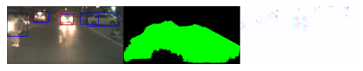
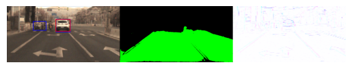
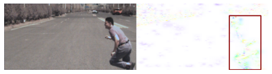
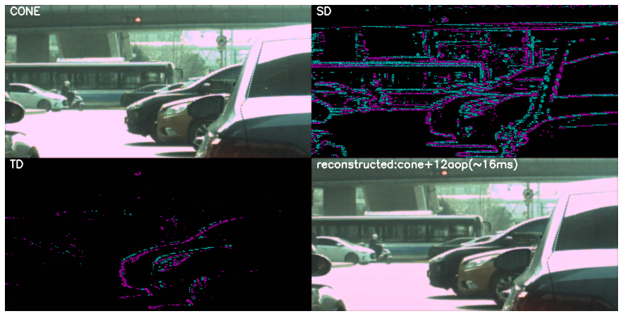

# TianmoucAlg

## Arch of this project

├── code

│      └── reconstruction : The reconstruction algrithm for tianmouc raw data

│      └── demo       : the automotive driving perception algorithm

│      └── tianmoucv  : some basic algorithm for tianmouc raw data

│      └── datareader : the raw data decoder and data reader

│      └── data(tianmouc_evaluation_data): Part of the labeled data for demo evaluation and ckpts

│          └── ckpts  : 3 pytorch models used in this paper
  
│          └── demo_data : 5 samples used in Fig 4

│          └── recon_data : some clips for reconstruction

│      └── resources: some pre-run results.

│      └── install.sh you can use this script for fast env building

## requirement

```bash
git clone  
conda create -n tianmouc python=3.10
sh install.sh
```
## prepare Dataset

download the dataset in [] and decompress it.

use soft link to create a easy data access for this respo:

```bash
cd [N_pub_code]
ln -s [your dataset path] data
'''

and the director structure will be like

ckpts
14 days ago 
demo_data
13 days ago 
recon_data


## EASY START

The code are replicated using python with jupyter notebook

- Fig. 4 with mAP evaluation
```
  /code/demo/Evaluation_complex.ipynb
```
  
  
  
  
  *the OF data need to be calculated using raw data*
  
  
  
You can change the  **key(name) of dataset** to find more demo for Fig4 or automotive driving 
The labeled datasets are in /data/tianmouc_evaluation_data
  
- anti-aliasing reconstruction
```
  /code/reconstruction/reconstruction.ipynb
```
  
  


